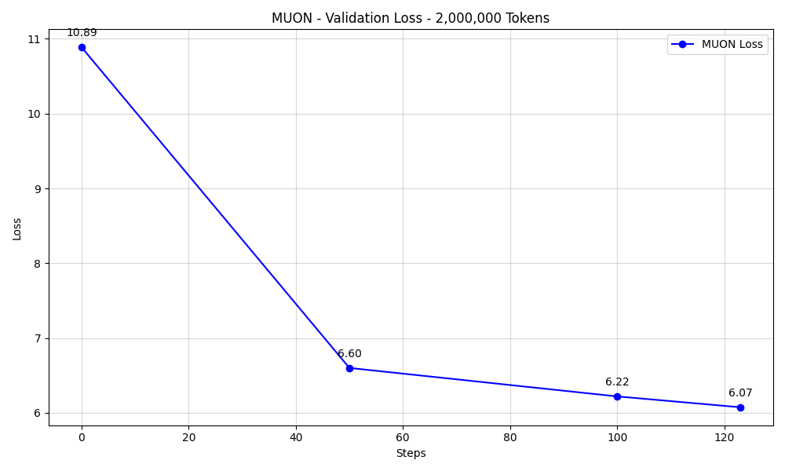
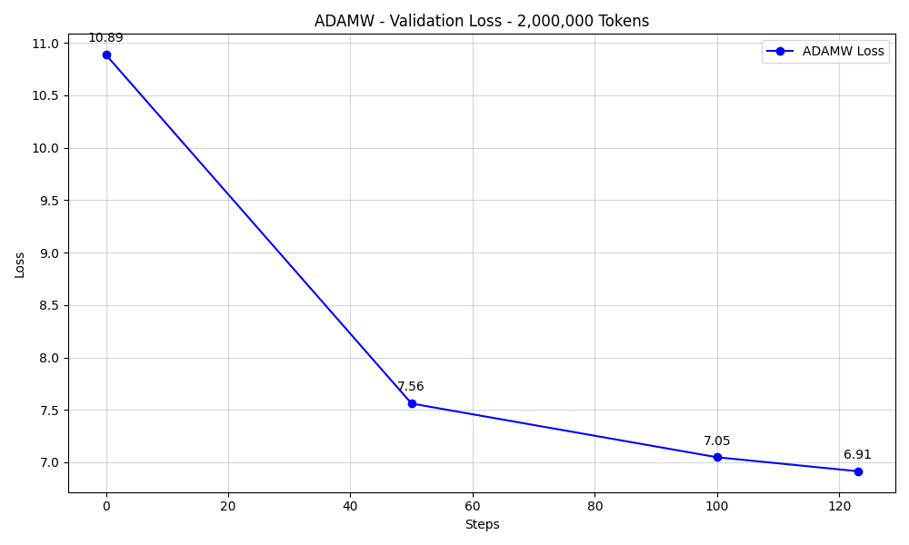

# Experiment Report: Muon vs. AdamW (2M Tokens Speedrun)

## 📊 Summary
This experiment compared the **Muon** optimizer against **AdamW** for a 2M token pre-training run on a 88M parameter MinimalLLM. 

| Metric | Muon | AdamW | Difference |
| :--- | :--- | :--- | :--- |
| **Final Val Loss** | **6.0748** | 6.9147 | -0.84 (Muon wins) |
| **Final Val Accuracy** | **16.29%** | 10.10% | +6.19% |
| **Training Time** | ~1m 54s | **~1m 01s** | AdamW is faster per step |

---

## 📈 Performance Comparison

### Validation Loss

Muon demonstrated a significantly faster convergence rate in the early stages of training. By 2M tokens, Muon reached a validation loss that AdamW likely wouldn't reach for several more million tokens.

---

## 🔍 Manifold Analysis & Spectral Dynamics

The most striking differences are found in the internal weight dynamics:

### 1. Spectral Norm Evolution
Muon keeps spectral norms near the unit circle, while AdamW allows them to blow up.
| Muon Spectral Norm | AdamW Spectral Norm |
| :--- | :--- |
|  |  |

### 2. Spectral Rank (Entropy)
AdamW suffers from "rank collapse," where most information is concentrated in a few singular values. Muon preserves the diversity of the subspaces.
| Muon Entropy | AdamW Entropy |
| :--- | :--- |
|  |  |

### 3. Update Alignment
Muon's orthogonal updates are more "efficient" at exploring the manifold without causing degradation.
| Muon Update Alignment | AdamW Update Alignment |
| :--- | :--- |
|  |  |

### 4. Singular Value Spectrum (MRI)
The "Singular Spectrum" (MRI) plot shows how the singular values spread out over time.
| Muon Spectrum | AdamW Spectrum |
| :--- | :--- |
|  |  |

---

## 🧪 Conclusion
**Muon is significantly superior** for this training regime. It prevents the spectral collapse seen in AdamW and achieves much better loss and accuracy in the same token budget. While AdamW is slightly faster in terms of raw wall-clock time per step (due to the absence of the SVD-based orthogonalization), the **sample efficiency** of Muon more than makes up for the overhead.

### Recommendations:
1. **Continue using Muon** for all 2D parameter updates in deep transformer models.
2. **Monitor Spectral Norms**: If spectral norms start to exceed 4.0-5.0 in Muon, consider adjusting the learning rate or momentum.
3. **Research**: The rapid collapse in AdamW suggests that traditional optimizers are struggling to maintain the manifold structure of the weights at this scale/learning rate.

