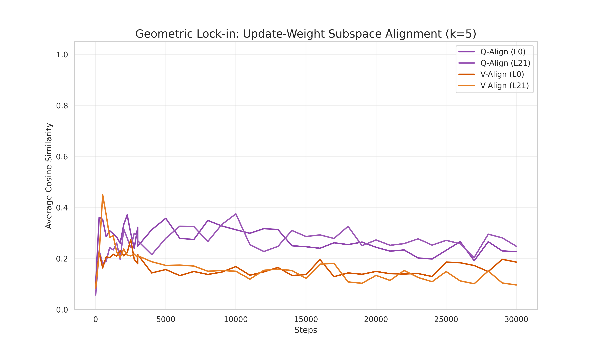
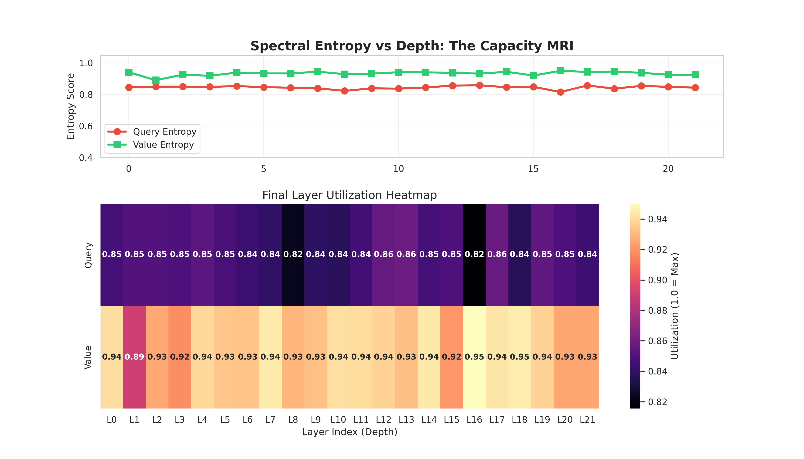
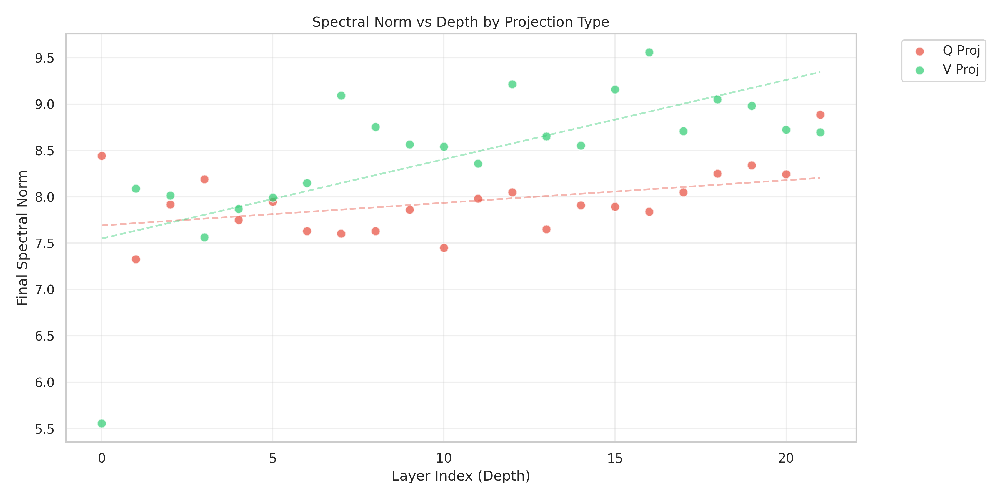
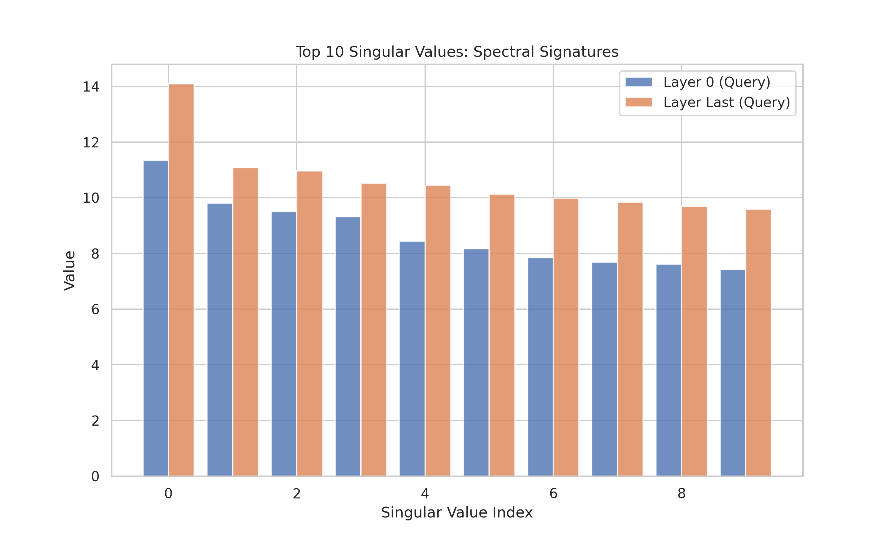
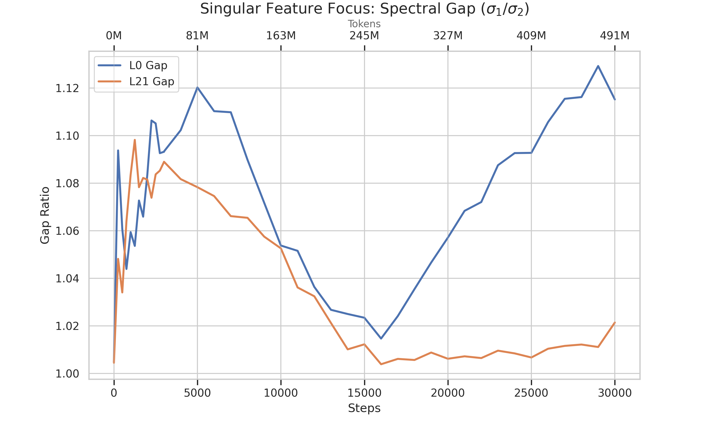
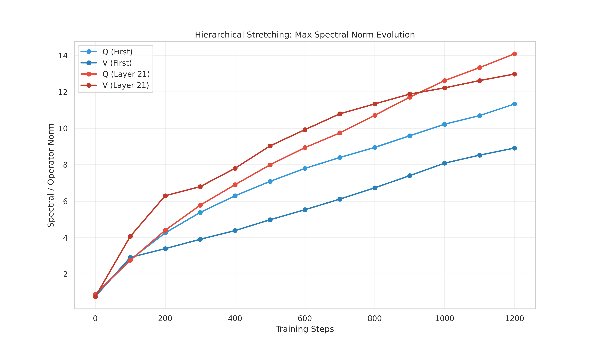
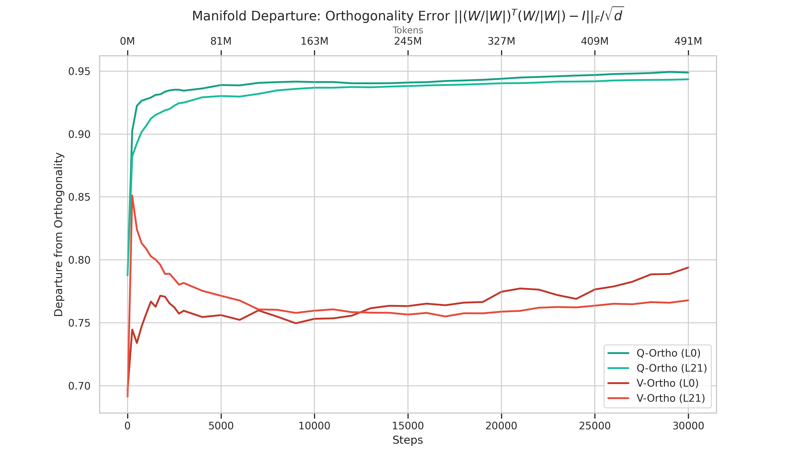
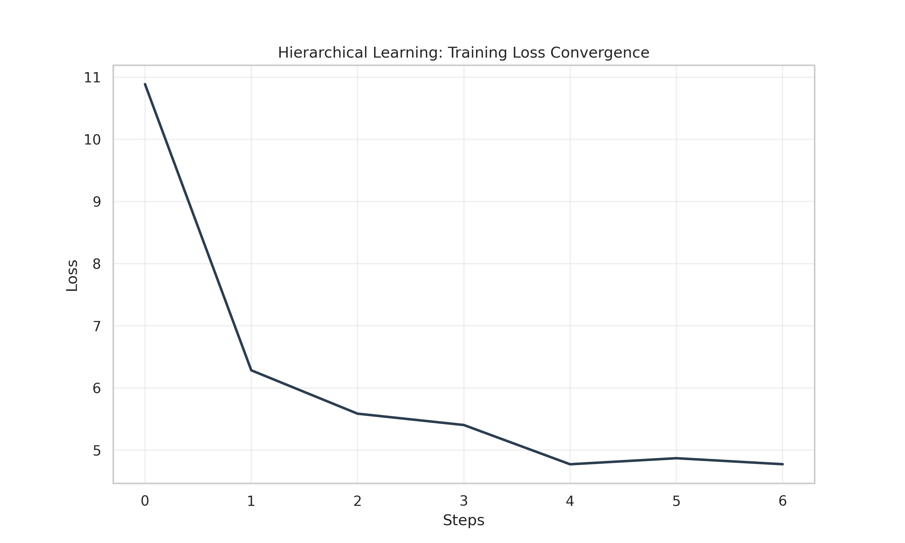

# 9 Plots For Neural Net (& LLM) Optimizers Research

### 1. Update-Weight Alignment (`update_alignment.png`)

How much is optimizer trying to change the weights - measuring cosine similarity of few largest singular values' directions of the update matrix vs the weight matrix - if they point to the same direction, the optimizer thinks these weights are good just need a bit of fine-tuning.

### 2. Update Rank Evolution (`update_rank_evolution.png`)

Measures the effective rank of the momentum buffer (raw updates before orthogonalization).
How many dimensions is the optimizer using to represent information? In LLMs, we often see "Update Rank Decay." Early in training, the optimizer uses many dimensions (The Wave) to find the general area. As it settles, it focuses on a few key directions (The Needle). If the rank stays high, the model is still in "Discovery Mode." If it drops too early, it might be getting lazy and ignoring complex features.

### 3. Subspace Efficiency (`subspace_efficiency.png`)

The ratio of $(Alignment / Update Rank)$. Think of this as "Bang for your Buck." 
High efficiency means the optimizer is achieving high alignment using very few dimensions. It identifies a "winning" low-dimensional manifold and pours all its energy into it. If efficiency is low, the optimizer is spraying updates everywhere without a clear plan.

### 4. Utilization Heatmap / MRI Scan (`entropy_mri.png`)

Spectral entropy of the weight matrices. It's like an MRI because it shows which parts of the "brain" (layers) are actually working. 
High entropy (bright) means the layer is using all its singular values to store information. Low entropy (dark) means most singular values have collapsed to zero, and the layer is barely doing anything. If your middle layers are all dark, your model is essentially a "shallow" model wearing a "deep" model's skin.

### 5. Spectral Norm vs. Depth (`spectral_norm_vs_depth.png`)

*   **What it measures**: The maximum singular value ($\sigma_{max}$) across layers.
*   **What it shows**: **Signal Growth (Hierarchical Stretching)**.
*   **Actionable Insight**: Essential for stability. If norms grow exponentially with depth, the model will suffer from gradient explosions. We use this to tune initialization scaling (like Hierarchical Stretching) to keep signal propagation unified.

### 6. Singular Spectrum Signature (`singular_spectrum.png`)

*   **What it measures**: The distribution of the top-10 singular values.
*   **What it shows**: **The Power-Law Signature**.
*   **Actionable Insight**: A healthy layer follows a clean power-law decay. A "flat" spectrum means the layer is acting like random noise (unlearned), while a "vertical" spectrum (one massive $\sigma_1$) means it is extremely specialized and potentially nearing saturation.

### 7. Spectral Gap Evolution (`spectral_gap.png`)

*   **What it measures**: The ratio of $\sigma_1 / \sigma_2$.
*   **What it shows**: **Singular Feature Dominance**.
*   **Actionable Insight**: In attention layers ($Q$), a growing gap marks the birth of a "Super-Head"—an attention mechanism that has become disproportionately dominant in routing the model's logic.

### 8. Spectral Stretching Evolution (`spectral_stretching_evolution.png`)

*   **What it measures**: Stable rank ($\|W\|_F^2 / \sigma_{max}^2$).
*   **What it shows**: **Weight Matrix "Breadth"**.
*   **Actionable Insight**: This is a leading indicator of training instability. A plummeting stable rank usually precedes a loss spike, as the model's internal representations are "pinching" into too few dimensions.

### 9. Orthogonality Error (`orthogonality_error.png`)

*   **What it measures**: Departure of the weight matrix from the Stiefel (orthogonal) manifold.
*   **What it shows**: **Optimizer Precision**.
*   **Actionable Insight**: A QA check for Muon. If this error grows, the Newton-Schulz or Polar Express iterations are failing, and the "Orthogonal Advantage" of the optimizer is being lost.

### 10. Training Loss (`loss.png`)

The standard measure of progress. It should show a smooth, downward trend as the model learns. In the context of our 500M run, we use it to correlate loss "plateaus" with geometric events like **Lock-in** or **Rank Collapse**.

---

## Conclusion: The Signature of Learning
Geometric Lock-in is not a failure—it's the signature of a discovered abstraction. Muon's power lies in making sure that lock-in happens because the model found the truth, not because the optimizer ran out of directions.

As we scale to **500M tokens**, we are looking for this signature to persist: stable, low-rank "Routing" supporting a dynamic, high-rank "Content" engine.
