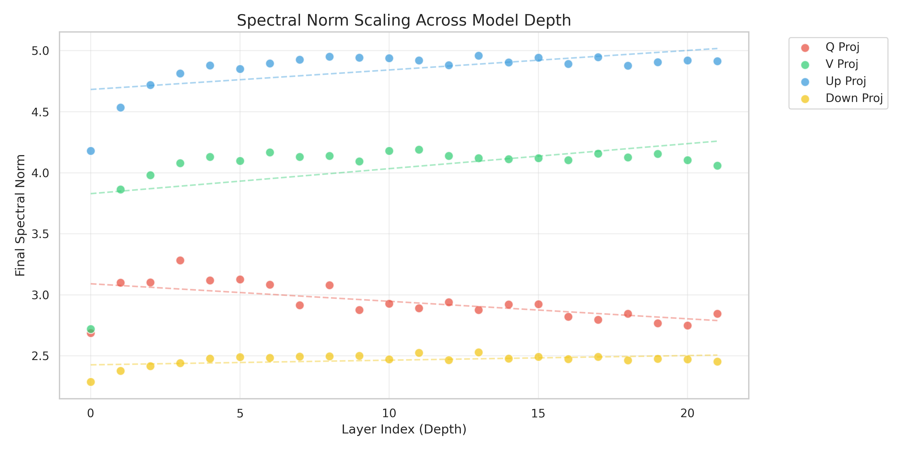
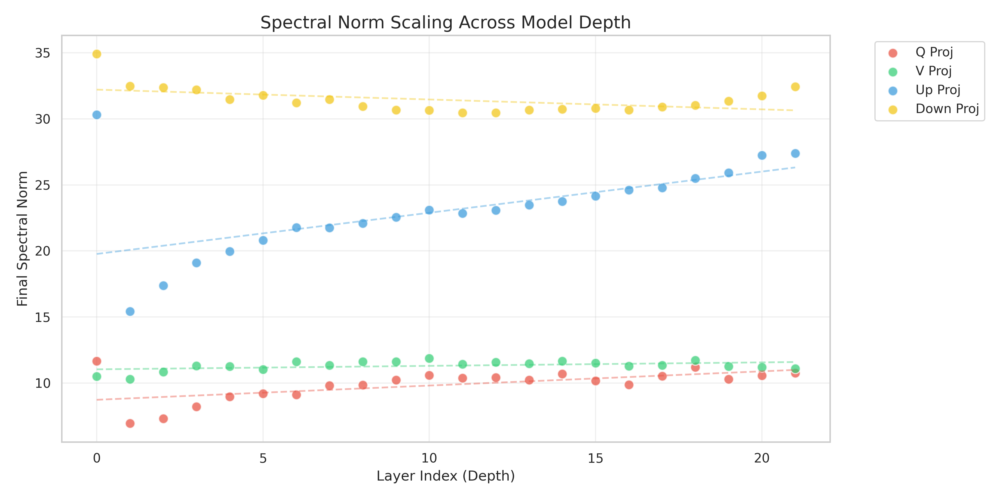
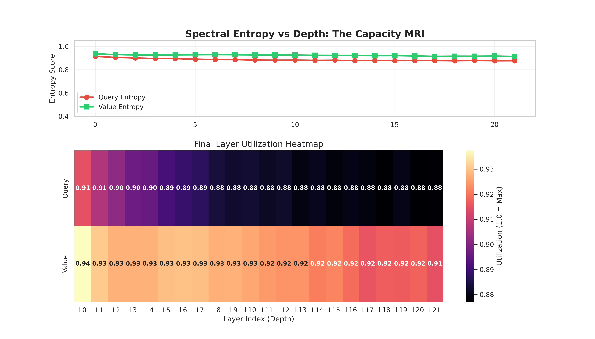
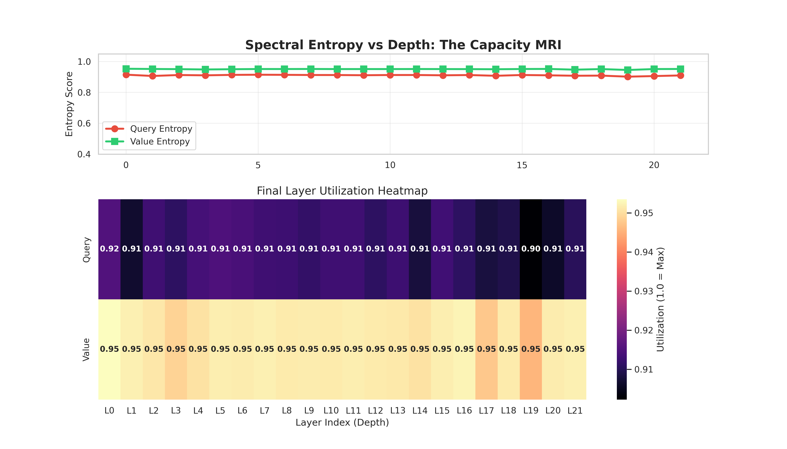
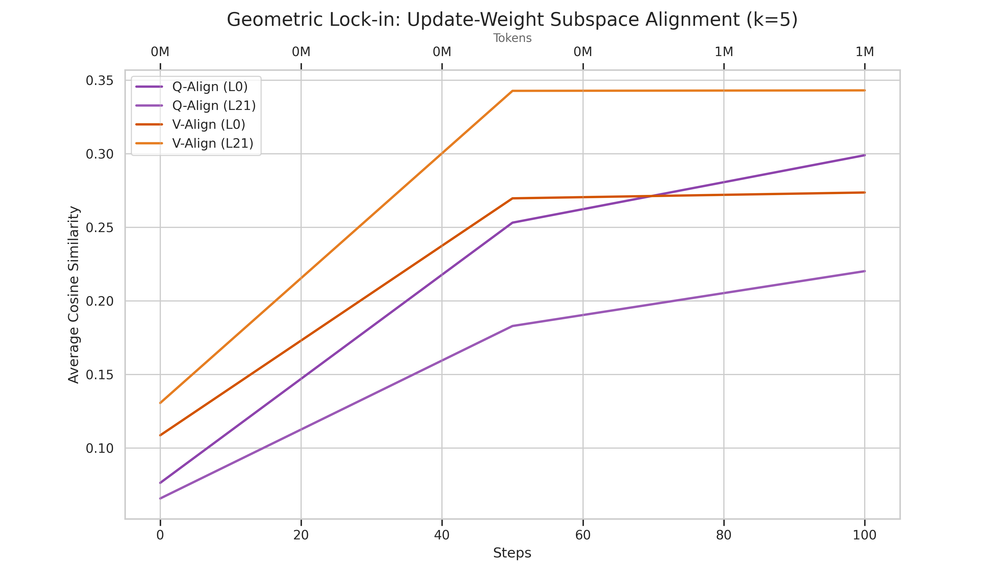
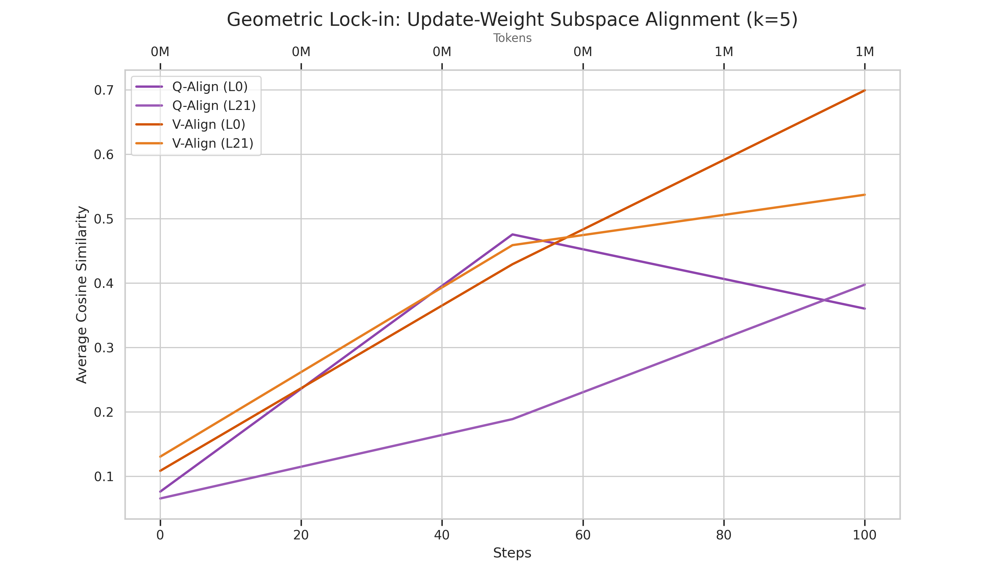
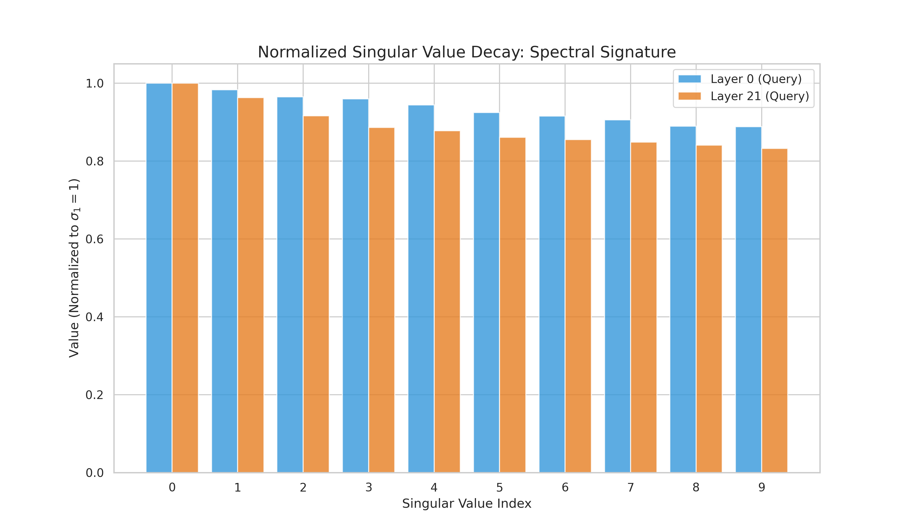
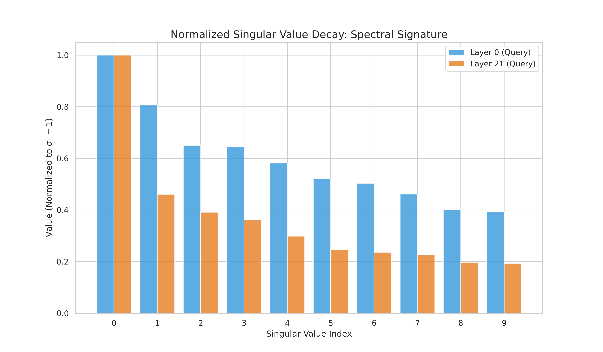

Here is my LLM research experiment plan:

## Goal is to improve LLM training

To start, I will train an 88M parameter LLM on 2B tokens of text data (compute constrains, my friends will scale this later)

0. Code is already setup for Muon, quick leraning rate search for AdamW only training.

1. I will start with 6 experiments, each one on 4090 GPU overnight
- Muon optimizer vs AdamW optimizer
- 3 seeds each to mitigate randomness

I will plot some metrics and check if the metrics show weird or unexpected results. For example:
Why does layer 3 behave differently from layer 9?
Why does rank collapse in AdamW happen at step X and not step Y?
Why do Q projections differ from V projections?
Is there a layer where Muon's entropy also drops? When? Why?

Here are metrics from a quick debugging run, we can already see some things:

### 1. Spectral Norm Evolution
The spectral norm (or $L_2$ norm) of a matrix $W$ is its largest singular value:
$$ \sigma_{\max}(W) = \max_{x \neq 0} \frac{\|Wx\|_2}{\|x\|_2} = \sigma_1(W) $$
AdamW's weights' spectral norms are a lot bigger.
| Muon Spectral Norm | AdamW Spectral Norm |
| :--- | :--- |
|  |  |

### 2. Spectral Rank (Entropy)
We measure "rank" using normalized Spectral Entropy, which quantifies the spread of the squared singular value distribution $p_i = \sigma_i^2 / \sum \sigma_j^2$:
$$ H_{\text{spec}} = -\frac{1}{\log(\text{rank})} \sum_{i} p_i \log p_i $$
AdamW suffers from "rank collapse," where most information is concentrated in a few singular values. Muon preserves the diversity of the subspaces.
| Muon Entropy | AdamW Entropy |
| :--- | :--- |
|  |  |

Rank collapse is generally **bad**; it means the model is effectively operating in a lower-dimensional subspace, wasting parameters. Muon's ability to preserve rank (maintaining high spectral entropy) allows all available dimensions to contribute to the model's representation, leading to better utilization of the 88M parameters.

### 3. Update Alignment
Update alignment measures the geometric overlap between the top-k singular subspaces of the weight matrix $W$ and its update $\Delta W$. It is calculated as:
$$ \text{Alignment} = \frac{1}{k} \sum_{i=1}^k \sigma_i(U_W^{k \top} U_{\Delta W}^k) $$
where $U_W^k$ and $U_{\Delta W}^k$ are the top-$k$ left singular vectors (using $k=5$ in our code).
| Muon Update Alignment | AdamW Update Alignment |
| :--- | :--- |
|  |  |

Higher alignment (typical in AdamW) suggests the optimizer is reinforcing existing dominant directions, whereas lower alignment in Muon often indicates a more exploratory update that utilizes more of the parameter manifold.

### 4. Singular Value Spectrum (MRI)
The "Singular Spectrum" (MRI) plot shows the distribution of all singular values $\sigma_i$ of a weight matrix $W$ over time. We plot the full set of eigenvalues of $\sqrt{W^T W}$:
$$ \text{Spectrum}(W) = \{ \sigma_1, \sigma_2, \dots, \sigma_d \} $$
| Muon Spectrum | AdamW Spectrum |
| :--- | :--- |
|  |  |
Muon maintains a remarkably flat spectrum compared to AdamW's "heavy-tailed" distribution, reflecting its orthogonalization property which prevents any single direction from dominating the weight updates.

Phase 1: Confirm (what you're already doing)
Do the plots differ between Muon and AdamW? Yes, in the ways you expect. Good. Sanity check passed. This is not publishable.