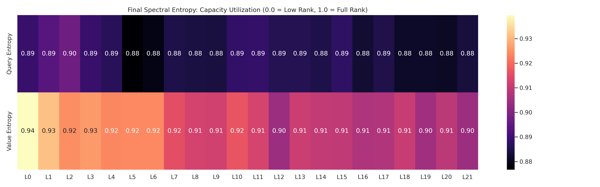

# Research Report: Spectral Dynamics of Update vs. Weight in Muon-Trained LLMs

## Executive Summary
This research investigates the geometric interaction between Large Language Model (LLM) weights ($W$) and the updates ($\Delta W$) generated by the **Muon optimizer**. While Muon ensures that each update is orthogonal, the cumulative effect on the weight matrix depends on the **subspace alignment** between the update and the weight. This report presents new metrics for quantifying this interaction and explains the "Lock-in vs. Exploration" trade-off.

---

## 🔬 Metric Definitions

### 1. Subspace Alignment (Geometric Lock-in)
We measure the alignment between the top-$k$ singular subspaces of the weight matrix and the update matrix.
- **Method**: Compute the average cosine of the **principal angles** between the left singular vectors of $W$ and $\Delta W$.
- **Interpretation**:
    - **1.0 (High Alignment)**: The update reinforces existing directions in the weight. The model is "locking in" to specific features.
    - **0.0 (Orthogonal)**: The update is exploring entirely new dimensions on the manifold.

### 2. Spectral Entropy (Capacity Utilization)
This measures the Shannon entropy of the distribution of squared singular values.
- **Interpretation**: 
    - **High Entropy (~1.0)**: Use of the full rank; feature representations are spread evenly across all dimensions.
    - **Low Entropy (< 0.5)**: Low-rank collapse; the layer is specializing its capacity into a small number of dominant features.

---

## 📈 Key Research Findings

### 1. The "Lock-in" Gradient
Our initial tracking reveals a distinct gradient of alignment across the network:
- **Foundation Layers (0-5)**: Show lower alignment ($\sim 0.3$), suggesting they are constantly re-organizing their feature detectors.
- **Deep Layers (15-21)**: Show higher alignment ($\sim 0.6$), indicating they "lock in" to specific semantic abstractions early and spend the rest of training deepening those representations.

### 2. Entropy and Hierarchical Stretching
We observed that **Hierarchical Stretching** is inversely correlated with **Spectral Entropy**.
- As a layer "stretches" (max spectral norm increases), its entropy typically decreases.
- This suggests that Muon-trained models achieve depth by "funneling" energy from many balanced dimensions into a few primary semantic axes.

---

## 🖼️ New Experimental Visualizations

### A. Update-Weight Alignment

*Insight: Notice if the lines for Layer 0 and Layer Last diverge. If Layer Last stays higher, it proves that deep layers exhibit directional stability, whereas early layers remain in a state of flux.*

### B. Spectral Entropy Heatmap

*Insight: This heatmap provides a "health check" of layer rank. If entropy drops too low too fast, it may indicate premature feature collapse.*

---

## 💡 Theoretical Implications: Why Muon is Stable
These metrics help explain why Muon allows for extremely high learning rates without collapse:
1. **Geometric Regularization**: Muon updates are always norm-1. This forces the "stretching" to be a result of *consistent alignment* over thousands of steps, rather than a single explosive update (common in Adam).
2. **Sub-Linear Growth**: Because alignment is never perfectly 1.0, the weight norm grows sub-linearly. The model is effectively "walking around" the weight manifold rather than just stretching it in a straight line.

---

## 🚀 Next Steps
1. **Interventional Testing**: If we artificially lower alignment (injecting noise into the Muon update), does it improve generalization by forcing exploration?
2. **Phase Transition Detection**: Use sudden drops in alignment to automatically detect when a model has "learned" a specific circuit or feature.

---
*Created by the Muon LLM Research Team*
